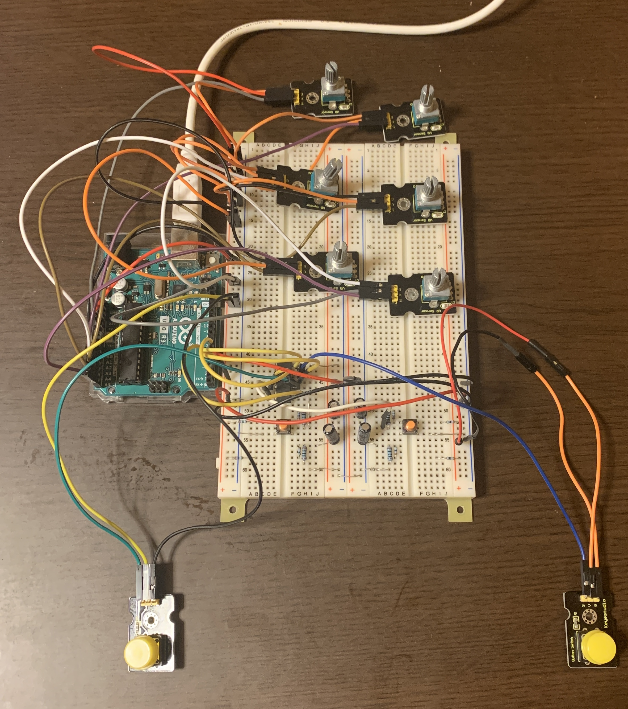

# Arduino_MIDI-controller

## 使用している主な技術

- Arduino UNO R3
- Hairless Midiserial
- Loop MIDI
- rekorbox ver.6(他，AlphaTheta 社製品の所持，もしくは rekordbox の有料プランへの加入が必要)

## 目次

1. [プロジェクトの概要](#プロジェクトの概要)
2. [コントローラの構築手順](#コントローラの構築手順)
3. [参考サイト](#参考サイト)

## プロジェクトの概要

本プロジェクトは，情報系学科の授業内の自由課題において，Arduino UNO R3 を用いて PCDJ 用 MIDI コントローラを構築するものである．

- コントローラの通信システムの概要は以下の図の通り．
  
- Arduino UNO から直接 MIDI 信号を送信するためには，ファームウェアの更新等を行う必要があったが，今回は Hairless Midiserial を用いて，プログラム上で送出したシリアル通信を MIDI 信号に変換し，Loop MIDI との通信を行う．
- また今回は時間的制約上，片方向の通信であったが，双方向の通信を行うことも勿論可能である．（再生・停止に応じて LED を光らせる等）
- 本プロジェクトのコントローラは以下の機能を持つ．
  - プレイヤーの再生/停止
  - キューイング
  - CFX エフェクト
  - 低音イコライザー
  - チャンネルフェーダー

## コントローラの構築手順

1. Arduino UNO R3 に以下のような任意のハードウェア回路を組み立てる．
   
2. Arduino IDE を用いて，MyController.ino で示されるスケッチを書き込む．
3. Loop MIDI を起動し，MIDI 通信の仮想ポートを作成．
4. rekordbox を起動し，MIDI LEARN[^1]モードで MIDI 信号と DJ 機能のマッピング[^2]を行う．

- 接続する MIDI コントローラを Loop MIDI に設定．

5. Hairless Midiserial を用いて，Arduino UNO R3 と Loop MIDI を接続する．
   - Hairless Midiserial の設定は以下の通り．
     - Serial port: Arduino UNO R3 が接続されているポート(COM3)
     - MIDI Out port: Loop MIDI
     - MIDI In port: Loop MIDI
6. 正しく接続されている場合，ハードウェアの操作により Hairless Midiserial 上で緑色のランプが点灯し， rekordbox の DJ 機能が制御される．

## 参考サイト

本プロジェクトにあたって，参考にさせていただいたサイトを以下に紹介します．

- [DIY MIDI DJ controller mixer with arduino and 3d printed parts](https://www.youtube.com/watch?v=Z1Fl6ekkipE)
- [MIDI ケーブルなしで Arduino と MIDI を送受信する方法](http://spinelify.blog.fc2.com/blog-entry-83.html)
